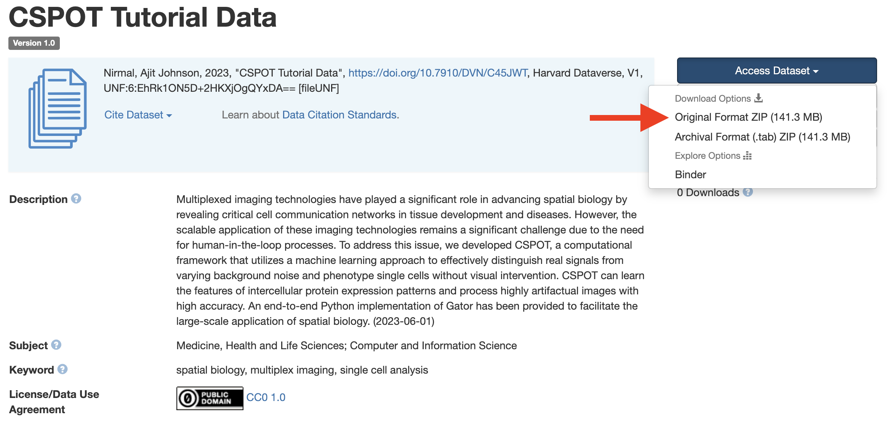
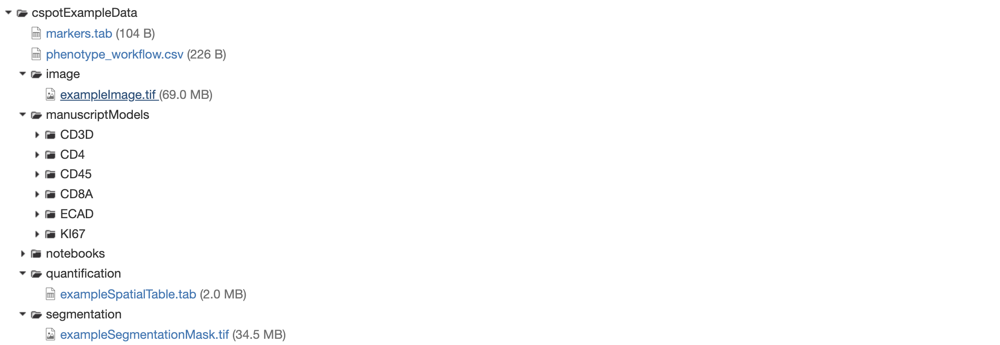

# 🎯 CSPOT Exemplar Data
A short guide to downloading our exemplar data for trying out the CSPOT algorithm.
  
If you want to try out the CSPOT algorithm, follow these simple steps to download our exemplar data:

1. Navigate to the Harvard Dataverse website and download the exemplar data (see screenshot below!)
  
    **[Data](https://doi.org/10.7910/DVN/C45JWT): https://doi.org/10.7910/DVN/C45JWT**



2. Click on the "Access Dataset" --> "Original Format ZIP" button.
3. Wait for the download to complete. The size of the file is approximately 12 MB.
4. Unzip the downloaded file to access the data.

**To ensure that you can follow the tutorial correctly, please make sure that the following folder structure (screenshot below) is maintained:**



<hr>

## Models used in the Manuscript

Please note that the purpose of this tutorial is to demonstrate how to run the cspot algorithm and should not be expected to produce meaningful results, especially in the model training section.
  
For your reference, we have included the models used in the associated manuscript in the `manuscriptModels` folder.
  
If you have any questions or encounter any issues while following the tutorial, please don't hesitate to contact us for assistance.


```python

```
